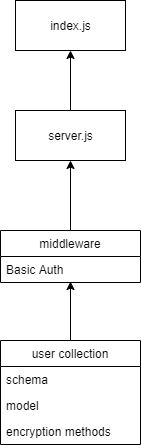
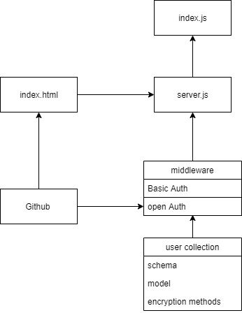

# LAB - Class 13: Bearer Auth

## Project: Auth-srever :phase 3

### Author: Dina Alsaid

### Setup

#### `.env` requirements (where applicable)

- `PORT=3000`
- `MONGODB_URI=mongodb://localhost:27017/users`
- `SECRET=shhhhThisIsASecret`
- `CLIENT_ID=b19a9b00fc5a28606025`
- `CLIENT_SECRET=e7e30a0e4eaeef24e0459d978904895bb56d37db`
- `API_SERVER=http://localhost:3000/oauth`

#### How to initialize/run your application (where applicable)

- `npm start`

#### How to use your library (where applicable)

#### Tests

- OAuth route works
- Basic Auth routes don't work yet

#### UML

