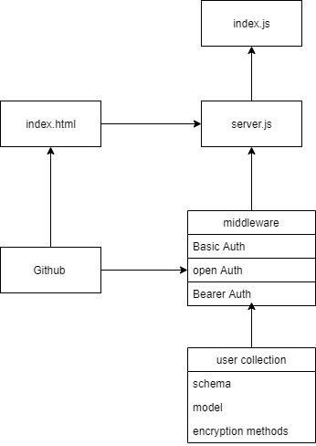

# Authentication server

## Project: Auth-srever

### Author: Dina Alsaid

### Setup

#### `.env` requirements (where applicable)

- `PORT=4000`

#### How to initialize/run your application (where applicable)

- `npm start`

- Endpoints
  - `/signup`
  - `/signin`
  - `/users`
  - `/oauth`
  - `/secret`

#### How to use your library (where applicable)

When signing up: will create a new unique record for the user in the database (username has to be unique) with a hashed password.
when signing in (Basic auth): when siging in with a valid user and password, a JWT is generated with an expiration time.
trying to access endpoints with bearer token: using token generated from sign in, token must be used within expiration time (starting from the time the user signed in)

<!-- #### Tests

- Bearer and basic auth tests are in the same file (basicAuth.test.js)
- Bearer Auth: JWT expires in 4sec for testing purposes, tests pass

- OAuth route works
- Basic Auth : signup and signin pass -->

<!-- #### UML

##### Class 11

  

##### Class 12

  

##### Class 13

   -->
